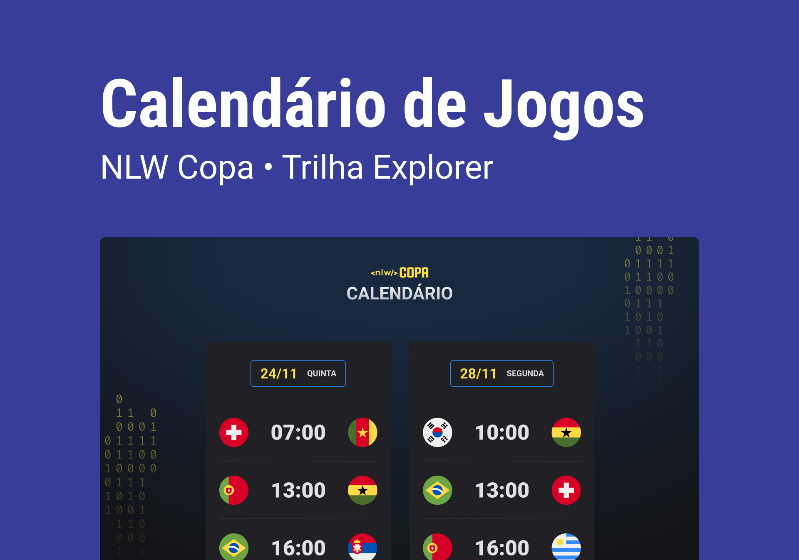

<h1 align="center"> NLW #10 Copa </h1>

Evento exclusivo e gratuito, promovido pela Rocketseat para ensino de tecnologias WEB.

  <a href="#tecnologias">Tecnologias</a>&nbsp;&nbsp;&nbsp; |&nbsp;&nbsp;&nbsp;
  <a href="#projeto">Projeto</a>&nbsp;&nbsp;&nbsp; |&nbsp;&nbsp;&nbsp;
  <a href="#layout">Layout</a>&nbsp;&nbsp;&nbsp; |&nbsp;&nbsp;&nbsp;
  <a href="#memo-licença">Licença</a>

  

 

  

## Tecnologias

Este projeto foi desenvolvido com as seguintes tecnologias:

- HTML e CSS
- JavaScript
- Git e Github

## Projeto

O Calendário do Mundial é um projeto que mostra todos os jogos do mundial de 2022

## Layout

O layout do projeto pode ser visualizado através deste link: https://www.figma.com/file/WHiNvAgWlJs9M6M9XtmWkk/Calend%C3%A1rio-de-Jogos-(Community)/duplicate.

É necessário ter conta no Figma para conseguir aceder. Crie a conta aqui: https://figma.com

## :memo: Licença

Este projeto está sob a licença MIT

---

Feito com ♥ by Rocketseat :wave:

Participa nesta comunidade através deste link: https://discord.gg/rocketseat
